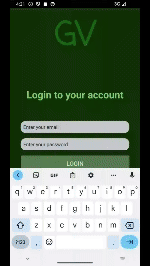

# GreenView
GreenView is an Android application, written in Java, JavaScript, and HTML using Android Studio.
designed for analyzing agricultural areas in Israel. The app integrates with the GovMap API to display maps with various layers and allows users to interact with the data through a graphical user interface (GUI).
It also features user registration and login functionality, storing user information in an SQLite database.

## Features

- Display maps with multiple layers using GovMap API.
- User registration and login with data stored in SQLite.
- User-friendly interface with navigation between different activities.

## Live Demo

